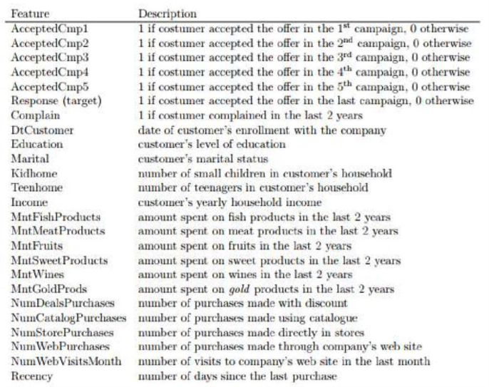

# Marketing

### Descrição

Você é um analista de marketing e foi informado pelo Diretor de Marketing que as campanhas recentes 
não têm sido tão eficazes quanto se esperava. 
Você precisa analisar o conjunto de dados para entender este problema e propor soluções baseadas em dados.
O conjunto de dados é composto por 2240 registros de 28 variáveis coletados pela empresa Marketing Planning Group, líder em estratégias de marketing no Brasil.

### Variáveis

### Questionamentos

* Quais fatores estão significativamente relacionados ao número de compras nas lojas?
* Os EUA (US) se saem significativamente melhor do que o resto do mundo em termos de compras totais?
* Seu supervisor insiste que as pessoas que compram ouro são mais conservadoras. Portanto, as pessoas que gastaram uma quantia acima da 
média em ouro nos últimos 2 anos teriam realizado mais compras nas lojas. Justifique ou refute esta afirmação.
* O peixe tem ômega 3, que é bom para o cérebro. Nesse sentido, os "candidatos ao doutorado que são casados" têm uma relação significativa com o valor gasto com peixes? Que outros fatores estão significativamente relacionados ao valor gasto com peixes? 
* Existe uma relação significativa entre a região geográfica e o sucesso de uma campanha?
* Qual campanha de marketing é mais bem-sucedida?
* Qual é o perfil do cliente médio para esta empresa?
* Quais produtos têm o melhor desempenho?
* Quais canais estão com baixo desempenho?

### Objetivo

Você deverá entregar um relatório técnico com as respostas aos questionamentos realizados no item anterior. Todas as respostas deve apresentar a sua respectiva análise estatística para justificar a sua resposta. O relatório deve ser entregue em documento PDF, junto ao arquivo fonte do script utilizado para a execução dos métodos estatísticos utilizados para resolver os questionamentos.

Prazo de entrega: 06/10/2021 às 23:59.

