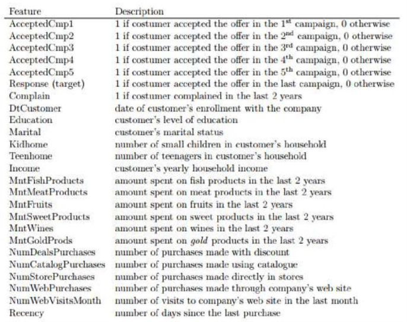

# Marketing

### Descrição

Você é um analista de marketing e foi informado pelo Diretor de Marketing que as campanhas de marketing recentes 
não têm sido tão eficazes quanto se esperava. 
Você precisa analisar o conjunto de dados para entender este problema e propor soluções baseadas em dados.
O conjunto de dados é composto por 2240 registros de 28 variáveis coletados pela empresa Marketing Planning Group, líder em estratégias de marketing no Brasil.

### Variáveis

Quais fatores estão significativamente relacionados ao número de compras na loja?
    Os EUA se saem significativamente melhor do que o resto do mundo em termos de compras totais?
    Seu supervisor insiste que as pessoas que compram ouro são mais conservadoras. Portanto, as pessoas que gastaram uma quantia acima da média em ouro nos últimos 2 anos teriam mais compras nas lojas. Justifique ou refute esta afirmação usando um teste estatístico apropriado
    O peixe tem ácidos graxos ômega 3, que são bons para o cérebro. Nesse sentido, os "candidatos ao doutorado casados" têm uma relação significativa com o valor gasto com peixes? Que outros fatores estão significativamente relacionados ao valor gasto com peixes? (Dica: use seu conhecimento de variáveis ​​/ efeitos de interação)
    Existe uma relação significativa entre a região geográfica e o sucesso de uma campanha?
