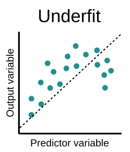

[//]: <> (https://pkg.garrickadenbuie.com/extra-awesome-xaringan/intro/index.html#1)
[//]: <> (https://pkg.garrickadenbuie.com/xaringanthemer/articles/xaringanthemer.html)
[//]: <> (https://www.biostatistics.dk/talks/CopenhagenRuseRs-2019/index.html#1)
[//]: <> (https://rstudio-education.github.io/sharing-short-notice/#1)
[//]: <> (https://www.kirenz.com/slides/xaringan-demo-slides.html#1)
[//]: <> (https://github.com/yihui/xaringan/issues/26)
class: animated, fadeIn
```{r xaringan-themer, include=FALSE, warning=FALSE}
library(xaringanthemer); library(dplyr); library("DT"); library(plotly) #library(icons)
style_mono_light(base_color = "#23395b")
```
```{r setup, include=FALSE}
options(htmltools.dir.version = FALSE)
```
```{r, load_refs, include=FALSE, cache=FALSE}
library("RefManageR"); library("bibtex")
BibOptions(check.entries = FALSE,
           bib.style = "authoryear",
           cite.style = "authoryear",
           style = "markdown",
           hyperlink = FALSE,
           dashed = FALSE)
myBib <- ReadBib("ref_ementa.bib", check = FALSE)
```

<style> body {text-align: justify} </style> <!-- Justify text. -->


### Modelos estatísticos: Enfoques
`r Citet(myBib, "breiman2001")` argumenta que existem duas culturas no uso de 
modelos estatísticos (em especial modelos de regressão):

* **Data modeling**: Esse enfoque domina a 
<span style="color:grey">comunidade estatística</span>. 
Sob essa abordagem, testar se   as suposições do modelo (por exemplo, 
normalidade dos erros, linearidade,   multicolinearidade, homocedasticidade, 
independência, etc.) são válidas é de fundamental importância. Ainda que 
predição muitas vezes faça parte dos objetivos, o foco em geral está na 
<ins>inferência</ins>.

--

* **Algorithmic modeling**: Esse enfoque domina a comunidade de 
<span style="color:grey">aprendizado de máquina</span>. Nesse contexto, o foco 
é a <ins>predição</ins> de novas observações. Não se assume que o modelo 
utilizado para os dados é correto. 
O modelo é utilizado apenas para criar bons algoritmos para prever bem novas 
observações. Muitas vezes não há nenhum modelo probabilístico explícito por 
trás dos algoritmos utilizados. Mesmo que o objetivo primordial de uma problema 
de predição seja obter um bom "poder" preditivo, a *interpretabilidade* do 
modelo final também é relevante.

```{r, out.width='40%', fig.align='center', fig.cap='',echo=FALSE}

```

---
class: animated, slideInRight

.center[### Tipos de Aprendizado I]

* **Supervisionado**: O objetivo é prever o valor de uma variável resposta 
(*output*) a partir de variáveis preditoras (*input*). Dentre as técnicas mais 
utilizadas com essa finalidade temos:
  - <ins>Modelos de regressão</ins> (linear, ridge, lasso, elastic net, esparsa, 
  robusta, Bayes ingênuo (*Naive Bayes*), etc.)
  - <ins>Modelos de classificação</ins> baseados em modelos de regressão logística,
  algoritmos de suporte vetorial (SVM - *support vector machines*), redes 
  neurais, análise discriminante linear e quadrática, árvores de decisão, 
  método do $k$-ésimo vizinho mais próximo (*KNN*), bagging e florestas 
  aleatórias, boosting etc.

* **Não supervisionado**: O objetivo é descrever associações e padrões entre
variáveis. Nesse caso, não há uma distinção entre variáveis preditoras e
respostas e só dispomos de um conjunto de variáveis (*inputs*). Dentre as técnicas 
mais utilizadas com essa finalidade, temos:
  - <ins>Redução de dimensionalidade</ins>: Análise de componentes principais, análise de 
  componentes independentes, análise fatorial, projeções aleatórias, *Autoencoders*, 
  etc.
  - <ins>Análise de agrupamentos</ins>: análise de conglomerados (*cluster*), *k*-médias 
  (*k-means*), métodos hierárquicos (*hierarchical clustering*), agrupamento 
  espectral, etc.
  - <ins>Detecção de anomalias</ins>: Fator de outlier local (LOF - *local outlier factor*),
  floresta de isolamento (*Isolation Forest*), etc.
  - <ins>Abordagens para aprender modelos de variáveis latentes</ins>: Algoritmo EM, método 
  dos momentos e técnicas de separação de sinal cego (*Blind signal separation*), etc.

---
class: animated, slideInRight

.center[### Tipos de Aprendizado II]
  
* **Por reforço**: Aprendizagem por reforço (RL) é uma área de aprendizagem de 
máquina preocupada de como os agentes inteligentes devem realizar ações em um 
ambiente a fim de maximizar a noção de recompensa cumulativa. 
A aprendizagem por reforço difere da aprendizagem supervisionada por não precisar 
da apresentação de pares de entrada/saída rotulados e por não precisar que ações 
abaixo do ideal sejam explicitamente corrigidas. Em vez disso, o foco está em 
encontrar um equilíbrio entre a exploração (de território não mapeado) e a 
exploração (de conhecimento atual). Dentre as técnicas mais utilizadas com essa 
finalidade, temos:
 - Critério de otimização (*Criterion of optimality*), Força bruta (*Brute force*), 
 aproximação ao valor da função (*Value function*), método de Monte Carlo, método
 de diferenças temporais, etc. 

***

> **Inteligência Artificial (IA)**<br></br>
A partir da década de 1990, o aprendizado automático criou um novo paradigma 
para analisar dados dificilmente solucionáveis sem o recente avanço na capacidade 
computacional. <br></br>
"*IA é um esforço para automatizar tarefas intelectuais usualmente realizadas 
por seres humanos.*"
.right[-- <cite>`r Citet(myBib, "chollet2018")`</cite>]


---
class: center, middle
background-image: url("images/evolucao_ML.png")
background-size: contain


---
class: animated, slideInRight

###  Modelos de regressão linear
Análise de regressão é uma técnica estatística que conduz a uma descrição 
matemática de um processo em termos de um conjunto de variáveis associadas.
Os métodos de regressão tiveram suas bases com o surgimento do método de mínimos
quadrados em $1795$ nos trabalhos de [Carl Friedrich Gauss](https://bityli.com/W5wkJ), 
quando Gauss tinha apenas dezoito anos. Entretanto, 
[Adrien-Marie Legendre](https://bityli.com/qwND5) foi o primeiro a publicar 
o método em $1805$, em seu _Nouvelles méthodes pour la détermination des orbites des comètes_. 
Gauss publicou suas conclusões apenas em $1809$.

De modo geral, o objetivo de um modelo de regressão é determinar a relação
entre uma variável aleatória $Y\in\mathbb{R}$ e um vetor 
$\mathbf{x}=(x_1,\dots,x_d)\in\mathbb{R}^d$. Mais especificamente, 
busca-se descrever tal relação estimando a função de regressão, dada por:
$$r(\mathbf{x})=\mathbb{E}[Y|\mathbf{X}=\mathbf{x}].$$
A análise de regressão consiste em modelar a relação funcional entre uma 
variável *resposta* e uma ou mais variáveis *explicativas*. Em outras palavras,
nosso principal objetivo será descrever algumas técnicas para estimar 
(ou *treinar*, como dito na literatura de <span style="color:grey">aprendizado 
de máquina</span>) a função $r(\mathbf{x})$.

> $Y$ também é chamada de variável *dependente*, ou *label* (rótulo). 
$x_1,\dots,x_d$ também são chamadas de variáveis *independentes*, ou *covariáveis*, 
ou *preditores*, ou *características* ou *features* (atributos).

---
class: animated, slideInRight

### Exemplo I
Pesquisadores suspeitam que a temperatura usada em um processo industrial afeta 
a dureza de um certo produto. Um experimento foi realizado e vários produtos
foram expostos a diferentes temperatura: $30, 40, 50$ e $60^oC$. Os resultados
obtidos foram:
.pull-left[
```{r, echo=FALSE}
dados<-tibble::tibble(read.csv("/home/ffajardo/Dropbox/working_papers/R_scripts/computacional/xarigan/db/dureza.csv",sep=","))
#knitr::kable(head(dados), format='markdown')
dados%>%
DT::datatable(class = "compact", rownames = FALSE, extensions = "Buttons",
              options = list(dom = 'tBp', 
                            buttons = list(
                                list(extend = 'csv', filename = "dureza"),
                                list(extend = 'excel', filename = "dureza"),
                                list(extend = 'pdf', filename = "dureza")), 
                            pageLength = 7))
```
 
]
.pull-right[
```{r, echo=FALSE,fig.align='right',message=FALSE,warning=FALSE}
fit <- lm(Dureza ~ Temperatura, data = dados)

plotly::plot_ly(dados,x=~Temperatura,y=~Dureza,type = "scatter")%>%
  layout(xaxis = list(range = c(29, 61), title="Temperatura (°C)"),
         autosize = FALSE, width = 400, height = 400,
         margin=list(l = 50, 
                     r = 50,
                     b = 80,
                     t = 80,
                     pad = 4),
         showlegend = FALSE
         )
```
]  


---
class: animated, fadeIn

### Exemplo I
Pesquisadores suspeitam que a temperatura usada em um processo industrial afeta 
a dureza de um certo produto. Um experimento foi realizado e vários produtos
foram expostos a diferentes temperatura: $30, 40, 50$ e $60^oC$. Os resultados
obtidos foram:
.pull-left[
* Os valores de uma variável frequentemente dependem dos níveis de algumas outras 
variáveis. No exemplo: *Dureza* é a variável dependente e *Temperatura* é a 
variável independente;

* Para cada experimento $i$, temos uma medida de *Temperatura* e uma medida de
*Dureza* resultante;

* Claramente o diagrama de dispersão sugere uma relação linear entre as duas 
variáveis. Existe uma tendência decrescente da *Dureza* do produto com
com a *Temperatura*.
]
.pull-right[
```{r, echo=FALSE,fig.align='right',message=FALSE,warning=FALSE}
fit <- lm(Dureza ~ Temperatura, data = dados)

plotly::plot_ly(dados,x=~Temperatura,y=~Dureza,type = "scatter")%>%
      add_trace(x = ~Temperatura, y = fitted(fit), type = "scatter", mode = "line",
              line = list(width = 1, color="red"))%>%
  layout(xaxis = list(range = c(29, 61), title="Temperatura (°C)"),
         autosize = FALSE, width = 400, height = 400,
         margin=list(l = 50, 
                     r = 50,
                     b = 80,
                     t = 80,
                     pad = 4),
         showlegend = FALSE
         )
```
]  

---
class: animated, slideInRight

### Exemplo II
Considere um estudo cujo objetivo é avaliar como a distância com que motoristas 
conseguem distinguir um determinado objeto varia com a idade. 
Nesse caso, a variável <ins>resposta</ins> é a distância e a variável 
<ins>explicativa</ins> é a idade. (Tomado de: Morettin & Singer(2020) 
[*Introdução à Ciência de Dados: Fundamentos e aplicações*.](https://bityli.com/ahLca)).

.pull-left[
```{r, echo=FALSE}
dados<-tibble::tibble(read.csv("/home/ffajardo/Dropbox/working_papers/R_scripts/computacional/xarigan/db/distancia.csv",sep=","))
#knitr::kable(head(dados), format='markdown')
dados%>%
DT::datatable(class = "compact", rownames = FALSE, extensions = "Buttons",
              options = list(dom = 'tBp', 
                            buttons = list(
                                list(extend = 'csv', filename = "distancia"),
                                list(extend = 'excel', filename = "ditancia"),
                                list(extend = 'pdf', filename = "ditancia")), 
                            pageLength = 8))
```
 
]
.pull-right[
```{r, echo=FALSE,fig.align='right',message=FALSE,warning=FALSE}
fit <- lm(distancia ~ idade, data = dados)

plotly::plot_ly(dados,x=~idade,y=~distancia,type="scatter")%>%
  add_trace(x = ~idade, y = fitted(fit), type = "scatter", mode = "line",
              line = list(width = 1, color="red"))%>%
  layout(xaxis = list(range = c(16, 86),title="Idade (anos)"),
         yaxis=list(title="Distância (cm)"),
         autosize = FALSE, width = 400, height = 400,
         margin=list(l = 50, 
                     r = 50,
                     b = 100,
                     t = 100,
                     pad = 4),
         showlegend = FALSE
         )
```
]  

---
class: animated, fadeIn

### Exemplo II
Considere um estudo cujo objetivo é avaliar como a distância com que motoristas 
conseguem distinguir um determinado objeto varia com a idade. 
Nesse caso, a variável <ins>resposta</ins> é a distância e a variável 
<ins>explicativa</ins> é a idade. (Tomado de: Morettin & Singer(2020) 
[*Introdução à Ciência de Dados: Fundamentos e aplicações*.](https://bityli.com/ahLca)).

.pull-left[
* O gráfico de dispersão sugere uma tendência decrescente da distância com a idade;

* Como a resposta para motoristas com a mesma idade (ou com idades bem
próximas) varia, o foco da análise é a estimação de uma tendência média;
 
* O objetivo da análise de regressão é quantificar essa tendência.
]
.pull-right[
```{r, echo=FALSE,fig.align='right',message=FALSE,warning=FALSE}
fit <- lm(distancia ~ idade, data = dados)

plotly::plot_ly(dados,x=~idade,y=~distancia,type="scatter")%>%
  add_trace(x = ~idade, y = fitted(fit), type = "scatter", mode = "line",
              line = list(width = 1, color="red"))%>%
  layout(xaxis = list(range = c(16, 86),title="Idade (anos)"),
         yaxis=list(title="Distância (cm)"),
         autosize = FALSE, width = 400, height = 400,
         margin=list(l = 50, 
                     r = 50,
                     b = 100,
                     t = 100,
                     pad = 4),
         showlegend = FALSE
         )
```
]  

---
class: animated, slideInRight

### Recursos computacionais 

Ao longo da disciplina usaremos preferencialmente a linguagem `R`. O repositório
de pacotes está disponível no site do [projeto R](ohttp://CRAN.R-project.org).
Dentre os pacotes estatı́sticos disponı́veis na linguagem R, aqueles mais
utilizados neste texto são: `car`, `stats`, `MASS`, `e1071`, `forecast`, `ggplot2`, 
`caret`, `robust`, `glmnet`, `Lars`, entre outros. As funções de cada pacote 
necessárias para a realização das análises serão indicadas ao longo da disciplina.

```{r, out.width='25%', fig.align='center', echo=FALSE}
knitr::include_graphics("https://www.r-project.org/Rlogo.png")
```

> Sugere-se a leitura do livro [`r Citet(myBib, "fox2019")` An R Companion to Applied Regression. 3rd Edition](https://bityli.com/gTnsQ).

---
class: animated, bounceInDown

### Notação

* **Variável resposta**: A variável $Y$ será denotada como

<div class="math">
\[Y=
\left[
\begin{array}{c}
Y_1 \\
Y_2 \\
\vdots\\
Y_n
\end{array}
\right]_{n\times1}=[Y_1,Y_2,\ldots,Y_n]'
\]
</div>

* **Variáveis explicativas**: As variáveis explicativas serão denotadas como

<div class="math">
\[\textbf{X}=
\left[
\begin{array}{ccccc}
1&x_{11}&x_{12}&\cdots&x_{1k} \\
1&x_{21}&x_{22}&\cdots&x_{2k} \\
\vdots&\vdots&\vdots&\ddots&\vdots\\
1&x_{n1}&x_{n2}&\cdots&x_{nk} \\
\end{array}
\right]_{n\times (k+1)}=[\mathbf{1} \quad \mathbf{x}_1\quad\cdots\quad \mathbf{x}_k], \qquad
\textbf{X}_1=
\left[\mathbf{x}_1\quad\cdots\quad \mathbf{x}_k\right],
\]
</div>

onde $\mathbf{x}_j$ representa o $j$-ésimo vetor coluna da matriz.

> Para detalhes, `r Citet(myBib, "searle2017")`.


---
class: animated, fadeIn

### Modelo de regressão linear
Consideremos o modelo de regressão linear dado por
$$Y=f(\mathbf{x}_1,\mathbf{x}_2,\ldots,\mathbf{x}_k)+\mathbf{\epsilon},$$
onde $f(\cdot)$ é uma função desconhecida. O objetivo será estudar a relação entre
a variável dependente e as variáveis independentes, i.e., estimar a função $f$.

Dessa forma, para estimar a função $f$ são necessárias um conjunto de suposições 
a respeito da natureza do dados, a seguir:

**A1.** O modelo é linear, i.e. $Y=\beta_0\mathbf{1}+\beta_1\mathbf{x}_1+\beta_2\mathbf{x}_2+\cdots+\beta_k\mathbf{x}_k+\mathbf{\epsilon}$;

--

**A2.** A matriz de regressores tem posto coluna completo;

--

**A3.** Exogeneidade das variáveis independentes, i.e. $\mathbb{E}[\mathbf{\epsilon}|\mathbf{X}]=\mathbf{0}$;

--

**A4.** Esfericidade dos erros, i.e. $\mathbb{E}[\mathbf{\epsilon\epsilon}'|\mathbf{X}]=\sigma^2\mathbf{I}$;

--

**A5.** Os erros são normalmente distribuidos, i.e. $\mathbf{\epsilon|\mathbf{X}}$ segue uma distribuição
normal multivariada com vetor de médias $\mathbf{0}$ e matriz de covariâncias $\sigma^2\mathbf{I}$.


---
class: inverse, hide-logo, middle, center

# A1. Linearidade


---
class: animated, slideInRight

## A1. Linearidade
Ao longo da disciplina assumiremos que o modelo é linear, tal que

$$Y=\mathbf{X}\mathbf{\beta}+\mathbf{\epsilon}$$
ou
$$Y=\beta_0\mathbf{1}+\beta_1\mathbf{x}_1+\beta_2\mathbf{x}_2+\cdots+\beta_k\mathbf{x}_k+\mathbf{\epsilon}$$
ou

<div class="math">
\[\left[
\begin{array}{c}
Y_1 \\
Y_2 \\
\vdots\\
Y_n
\end{array}
\right]_{n\times1}=
\left[
\begin{array}{ccccc}
1&x_{11}&x_{12}&\cdots&x_{1k} \\
1&x_{21}&x_{22}&\cdots&x_{2k} \\
\vdots&\vdots&\vdots&\ddots&\vdots\\
1&x_{n1}&x_{n2}&\cdots&x_{nk} \\
\end{array}
\right]_{n\times (k+1)}
\left[
\begin{array}{c}
\mathbf{\beta}_0 \\
\mathbf{\beta}_1 \\
\vdots\\
\mathbf{\beta}_k
\end{array}
\right]_{(k+1)\times1}+
\left[
\begin{array}{c}
\mathbf{\epsilon}_1 \\
\mathbf{\epsilon}_2 \\
\vdots\\
\mathbf{\epsilon}_n
\end{array}
\right]_{n\times1}.
\]
</div>

A $i$-ésima equação simultânea é dada por

$$Y_i=\beta_0+\beta_1x_{i1}+\beta_2x_{i2}+\cdots+\beta_kx_{ik}+\epsilon_i, \qquad i=1,2,\ldots,n.$$
---
class: animated, bounceInDown
### Interpretação do termo "Linear"

O termo "<em>linear</em>" pode ser interpretado de duas maneiras:

* **Linearidade nas variáveis**:  a linearidade em termos das variáveis sugere 
que a função de regressão é do tipo

$$r(\mathbf{x})=\mathbb{E}[\mathbf{Y}|\mathbf{X}=\mathbf{x}]=\beta_0+\beta_1\mathbf{x}_1+\beta_2\mathbf{x}_2+\cdots+\beta_k\mathbf{x}_k.$$
Em particular, para $k=1$
$$r(x_i)=\mathbb{E}[Y_i|X=x_i]=\beta_0+\beta_1x_i, \quad i=1,2,\ldots,n$$
a função de regressão é uma <ins>reta</ins>.

De acordo com essa interpretação, funções de regressão do tipo

$$r(x_i)=\mathbb{E}[Y_i|X=x_i]=\beta_0+\beta_1x^2_i, \quad i=1,2,\ldots,n$$
não são funções lineares, pois a covariável $x_i$ é quadrática.


---
class: animated, fadeIn
### Interpretação do termo "Linear"

* **Linearidade nos parâmetros**:  A diferença com a interpretação anterior, as 
covariáveis não são necessariamente lineares, por exemplo, mesmo que as 
covariáveis sejam quadráticas, a função de regressão é linear.

Em particular, para $k=1$
$$r(x_i)=\mathbb{E}[Y_i|X=x_i]=\beta_0+\beta_1x^2_i, \quad i=1,2,\ldots,n$$
a função de regressão é uma função <ins>linear</ins>. Mas, a função

$$r(x_i)=\mathbb{E}[Y_i|X=x_i]=\beta_0+\sqrt{\beta_1}x_i, \quad i=1,2,\ldots,n$$
não é uma função de regressão linear. Este último caso é classificado no conjunto
de funções de regressão não-lineares.

>Das duas interpretações, a **linearidade nos parâmetros** é considerada a mais 
relevante para o desenvolvimento teórico que nos interessa. Dessa forma, de agora
em diante, o termo <em>regressão linear</em> será relativo a uma <ins>regressão
linear nos parâmetros</ins>.


---
class: animated, lightSpeedIn
###  Termo de erro (ou perturbação estocástica) - I

Considere o modelo linear dado por

$$Y=\mathbf{X}\mathbf{\beta}+\mathbf{\epsilon},$$
o vetor de erros $\mathbf{\epsilon}$ considera-se uma variável aleatória 
**não-observável** e de certa forma considera-se um substituto daquelas 
variáveis "omitidas" no modelo que certamente afetam o vetor $Y$.
Essa "omissão" de variáveis pode ser causada, entre outras coisas, por 

* *indisponibilidade de dados*: as vezes não é possível dispor das informações 
que idealmente gostariamos de ter no modelo, mesmo sabendo da relevância de
certas covariáveis; 

* *considerar uma forma funcional errada*: mesmo que tenhamos as variáveis 
teoricamente certas para explicar um fenômeno, muitas vezes podemos assumir um
formato funcional errado. Por exemplo: No modelo de uma covariável,
a forma funcional correta pode ser dada por $Y_i=\beta_0+\beta_1x_i+\epsilon_i$, 
$i=1,2,\ldots,n$, mas o pesquisador pode assumir 
$Y_i=\beta_0+\beta_1x_i+\beta_2x^2_i+\epsilon_i$. Nesse contexto, parece evidente
avaliar a forma funcional usando um diagrama de dispersão, mas em modelos que
envolvem mais covariáveis não é simples determinar o formato funcional graficamente,
dada a limitação na visualização de diagramas de dispersão em múltiplas dimensões.

---
class: animated, fadeIn
### Termo de erro (ou perturbação estocástica) - II

* *Princípio da parcimônia*: Este princípio sugere que 
**modelos mais simples devem ser escolhidos** em detrimento dos mais complexos,
desde que a qualidade do ajuste seja similar. É claro que devemos evitar excluir 
variáveis importantes apenas para manter um modelo simples.


```{r, out.width='70%', fig.align='center', echo=FALSE}
knitr::include_graphics("images/overfitting.png")
```

> Quando avaliamos a qualidade de um ajuste, a utilização exclusiva do termo de 
erro pode levar a resultados enganosos. Um "bom" modelo não pode sofrer de 
_underfitting_ (subajuste) nem de overfitting (sobreajuste). Nesse último, o
modelo se ajusta muito bem aos dados, mas o seu desempenho para previsão é ruim.


---
class: animated, fadeIn

###  Termo de erro (ou perturbação estocástica) - III
.pull-left[
#### Underfitting

Neste cenário o desempenho do modelo já é <ins>ruim</ins> no próprio treinamento. 
O modelo não consegue encontrar relações entre as variáveis e o teste nem precisa 
acontecer. Este modelo já pode ser **descartado**, pois não terá utilidade.
```{r, out.width='50%', fig.align='center', echo=FALSE}

```
]

--

.pull-right[
#### Overfitting
Neste cenário, o modelo tem um desempenho excelente com os dados de *treino*, 
porém quando utilizamos os dados de *teste* o resultado é <ins>ruim</ins>. 
É comum ouvirmos que neste cenário o modelo *treinado* não tem capacidade de 
*generalização*.
```{r, out.width='50%', fig.align='center', echo=FALSE}
knitr::include_graphics("images/overfitting2.png")
```

]


---
class: animated, lightSpeedIn
# Referências

```{r refs, echo=FALSE, results="asis"}
PrintBibliography(myBib, .opts = list(check.entries = FALSE))
```

---
class: animated, hide-logo, bounceInDown
## Política de proteção aos direitos autorais

> <span style="color:grey">O conteúdo disponível consiste em material protegido pela legislação brasileira, sendo certo que, por ser
o detentor dos direitos sobre o conteúdo disponível na plataforma, o **LECON** e o **NEAEST** detém direito
exclusivo de usar, fruir e dispor de sua obra, conforme Artigo 5<sup>o</sup>, inciso XXVII, da Constituição Federal
e os Artigos 7<sup>o</sup> e 28<sup>o</sup>, da Lei 9.610/98.
A divulgação e/ou veiculação do conteúdo em sites diferentes à plataforma e sem a devida autorização do
**LECON** e o **NEAEST**, pode configurar violação de direito autoral, nos termos da Lei 9.610/98, inclusive podendo
caracterizar conduta criminosa, conforme Artigo 184<sup>o</sup>, §1<sup>o</sup> a 3<sup>o</sup>, do Código Penal.
É considerada como contrafação a reprodução não autorizada, integral ou parcial, de todo e qualquer
conteúdo disponível na plataforma.</span>

.pull-left[
```{r, out.width='50%', fig.align='center', fig.cap='',echo=FALSE}

```
]
.pull-right[
```{r, out.width='50%', fig.align='center', fig.cap='',echo=FALSE}
knitr::include_graphics("images/logo_neaest.png")
```
]
<br></br>
.center[
[https://lecon.ufes.br](https://lecon.ufes.br/) &emsp; &emsp;  &emsp; &emsp; [https://analytics.ufes.br](https://analytics.ufes.br)
]

<font size="2"><span style="color:grey">Material elaborado pela equipe LECON/NEAEST: 
Alessandro J. Q. Sarnaglia, Bartolomeu Zamprogno, Fabio A. Fajardo, Luciana G. de Godoi 
e Nátaly A. Jiménez.</span></font>
