class: animated, fadeIn
```{r xaringan-themer, include=FALSE, warning=FALSE}
library(xaringanthemer); library("DT"); library(plotly) #library(icons)
style_mono_light(base_color = "#23395b")
```
```{r setup, include=FALSE}
options(htmltools.dir.version = FALSE)
```
```{r, load_refs, include=FALSE, cache=FALSE}
library("RefManageR"); library("bibtex")
BibOptions(check.entries = FALSE,
           bib.style = "authoryear",
           cite.style = "authoryear",
           style = "markdown",
           hyperlink = FALSE,
           dashed = FALSE)
myBib <- ReadBib("ref_ementa.bib", check = FALSE)
```

<style> body {text-align: justify} </style> <!-- Justify text. -->

### Documentação

O material apresentado foi extraído da documentação oficial do `Git`,
disponível em [http://git-scm.com/doc](http://git-scm.com/doc). 
Especialmente do livro **Pro Git** publicado por `r Citet(myBib, "chacon:straub:2021")`, cuja versão em português está 
disponível em [http://git-scm.com/book/pt-br/v2](https://github.com/progit/progit2-pt-br/releases/download/2.1.45/progit.pdf).


### Versão do Git
Este material foi preparado usando a versão `2.33.1` do `Git`. 
Como o `Git` é excelente para preservar compatibilidade com versões 
anteriores, qualquer versão após `2.0` deve funcionar muito bem.

---
class: animated, slideInRight

### Git

O `Git` é um sistema de **controle de versões** usado para registrar
o histórico de alterações de qualquer tipo de arquivo. O `Git` foi 
inicialmente projetado e desenvolvido por _Linus Torvalds_ para o 
```{r, out.width='25%', out.extra='style="float:right; padding:20px"', echo=FALSE}

```
desenvolvimento do kernel Linux, e hoje é adotado por muitas pessoas
ao redor do mundo para o desenvolvimento de projetos. 

** Algumas considerações**
- Multiplataforma e software livre;
- Integridade: Isto significa que é impossível mudar o conteúdo de 
qualquer arquivo ou pasta sem que `Git` saiba. Dessa forma, você não 
perderá informação durante a transferência e não receberá um arquivo 
corrompido sem que o `Git` seja capaz de detectar;
- Manipula eficientemente projetos extensos: O `Git` não fica lento com
o aumento do histórico do projeto;
- Relevante à medida que participa de projetos colaborativos,
facilitando a reprodutibilidade científica.

```{r, out.width='20%', fig.align='center', echo=FALSE}
knitr::include_graphics("images/Git_logo.png")
```

---
class: animated, slideInRight

### Instalando o Git

Antes de começar a usar o `Git`, o primeiro é torná-lo disponível no 
seu computador. A instalação é bastante simples. Você poderá instalá-lo 
como um pacote ou por meio de outro instalador, ou baixar o código fonte 
e compilá-lo. 

* **Linux**: Se você usa uma distribuição baseada no `Debian`, como
por exemplo `Ubuntu`, a instalação pode ser feita via linha de comando
usando:
          $ sudo apt-get install git-all
Para mais opções de instalação em outros sistemas `Unix`, consulte em
[http://git-scm.com/download/linux](http://git-scm.com/download/linux).

* **Windows**: Para o caso do Windows basta ir no site de [downloads](http://git-scm.com/download/win) e identificar o instalador 
de acordo com a arquitetura do seu computador (32-bit ou 64-bit) e 
executá-lo.

* **Mac**: No caso do Mac, você pode usar o administrador de pacotes `homebrew`
e usar a seguinte linha de comando
          $ brew install git

---
class: inverse, hide-logo, middle, center

# Configuração Inicial do Git


---
class: animated, fadeIn

### Configuração Inicial do `Git` - I

Agora que você instalou o `Git` em seu sistema, você deve personalizar 
o seu ambiente. Esse procedimento será realizado uma única vez
no seu computador e tal procedimento será mantido mesmo após atualizações. 
E é claro, você também pode mudá-las em qualquer momento realizando
o mesmo procedimento.

> **git config**: permite ver e atribuir variáveis de configuração que 
controlam todos os aspectos de como o `Git` aparece e opera. Em geral,
você pode consultar, definir, substituir e remover opções com este comando.

--

* **Sua identidade**<sup>1</sup>: A primeira coisa que você deve fazer ao instalar 
`Git` é configurar seu nome de usuário e endereço de e-mail, da seguinte 
forma:

```{r, out.width='70%', fig.align='center', echo=FALSE}
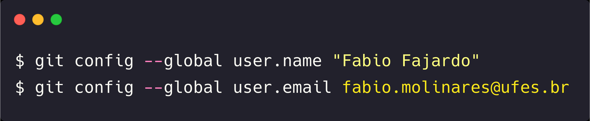
```

***
<font size="2"><sup>1</sup> Muitas Interfaces Gráficas de Usuário 
(Graphical User Interface  - GUI) o ajudarão com essa configuração
quando forem usadas pela primeira vez. Um quadro comparativo dessas
ferramentas para `Git` pode ser encontrado na 
<a href="https://en.wikipedia.org/wiki/Comparison_of_Git_GUIs">Wikipedia</a>.</font>

---
class: animated, slideInRight

###  Configuração Inicial do `Git` - II

* **Seu editor**: Uma vez configurada a sua identidade, você pode 
configurar o editor de textoque será usado com `Git`. Se não for 
configurado, o `Git` usará o editor padrão, que normalmente é o 
[Vim](https://www.vim.org/). Se você quiser mudar o editor de texto 
padrão, por exemplo<sup>1</sup>: [Emacs](https://www.gnu.org/software/emacs/), 
[Visual Studio Code](https://code.visualstudio.com/), 
[atom](https://atom.io/) ou [Textmate](https://macromates.com/), 
você pode usar uma das seguintes linhas de comando:

```{r, out.width='70%', fig.align='center', echo=FALSE}
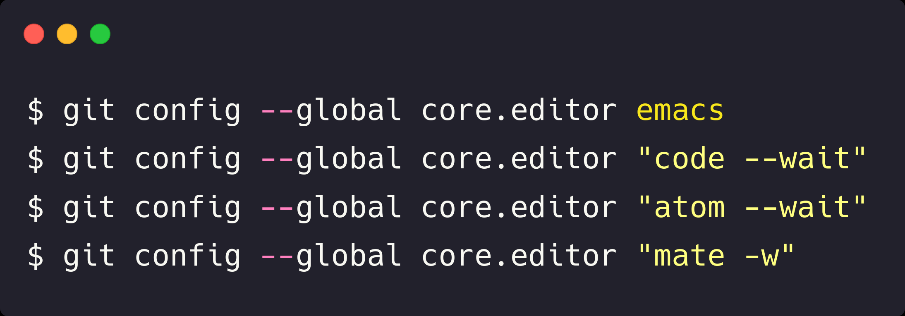
```

***
<font size="2"><sup>1</sup> Para mais opções de editores, consulte a
documentação oficial do `Git` disponível em 
<a href="https://git-scm.com/book/en/v2/Appendix-C%3A-Git-Commands-Setup-and-Config">A3.1 Appendix C: Git Commands - Setup and Config</a>.</font>


---
class: animated, slideInRight

### Configuração Inicial do `Git` - III

Para revisar a sua listagem de configurações basta usar o comando 
`git config --list` da seguinte forma:

```{r, out.width='70%', fig.align='center', echo=FALSE}
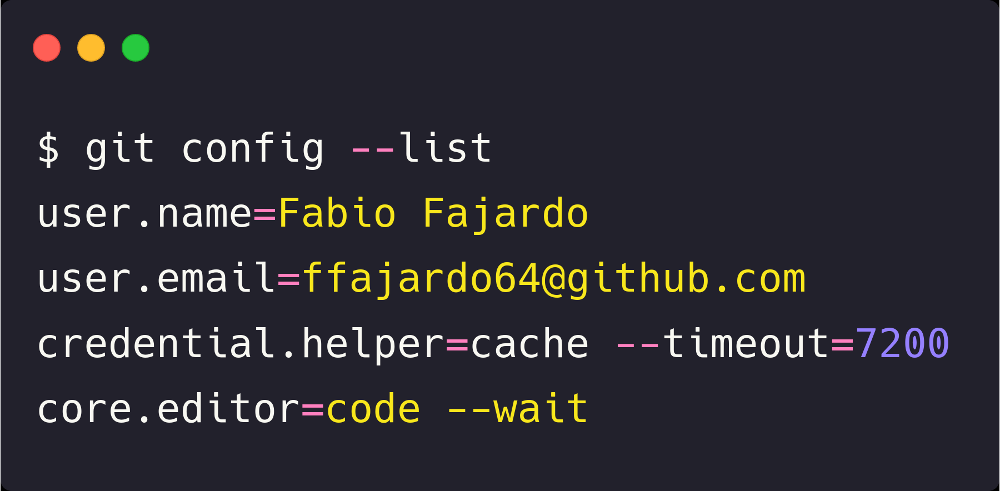
```

***
<font size="3"><sup>1</sup> Outras opções de configuração podem ser
revisadas na documentação oficial do `Git` disponível em 
<a href="http://git-scm.com/docs/git-config/pt_BR">http://git-scm.com/docs/git-config/pt_BR</a>.</font>

---
class: animated, fadeIn

### Ajuda no `Git`
* Para consultar a ajuda do `Git` existem três formas básicas:

  1. Consultando na documentação oficial [http://git-scm.com/doc](http://git-scm.com/doc);

  1. Usando o comando `git help <comando>`;

  1. `git <comando> --help`;

  > Por exemplo, use `git config --help` para verificar todas as opções
de configuração oferecidas pelo `Git`.

* Uma folha dicas (*cheat sheet*) está disponível para eventuais 
consultas em [https://training.github.com/](https://training.github.com/).
A versão em português se encontra [aqui](https://training.github.com/downloads/pt_BR/github-git-cheat-sheet.pdf);

* A listagem completa de comandos está disponível [aqui](http://git-scm.com/docs/git#_git_commands);

* Tutoriais, livros e vídeos sobre `Git` estão disponíveis em [http://git-scm.com/doc/ext](http://git-scm.com/doc/ext).

---
class: inverse, hide-logo, middle, center

# Fundamentos de Git


---
class: animated, fadeIn

### Os três estados do `Git`

Quando você faz algo no `Git`, quase sempre, dados são adicionados no 
banco de dados do `Git`. É difícil fazer alguma coisa no sistema que 
não seja reversível. Mas, para experimentar o `Git` sem perigo de 
realizar alguma ação indesejada, fique atento aos três estados 
principais do `Git`:
**Committed** (Consolidado), **Modified** (modificado) e **Staged** (preparado). 

* **Committed**: Consolidado significa que os dados estão armazenados 
de forma segura em seu banco de dados local;

* **Modified**: Modificado significa que você alterou o arquivo, mas 
ainda não fez o *commit* no seu banco de dados;

* **Staged**: Preparado significa que você marcou a versão atual de um 
arquivo modificado para fazer parte de seu próximo *commit*.


>Os três estados nos levam a três seções principais de um projeto `Git`: 
 - O diretório de trabalho;
 - A área de preparo;
 - O diretório Git (Repositório).

---
class: animated, slideInRight

### Fluxo de trabalho

```{r, out.width='70%', fig.align='center', echo=FALSE}
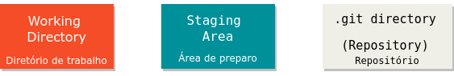
```

---
class: animated, fadeIn

### Fluxo de trabalho

```{r, out.width='70%', fig.align='center', echo=FALSE}
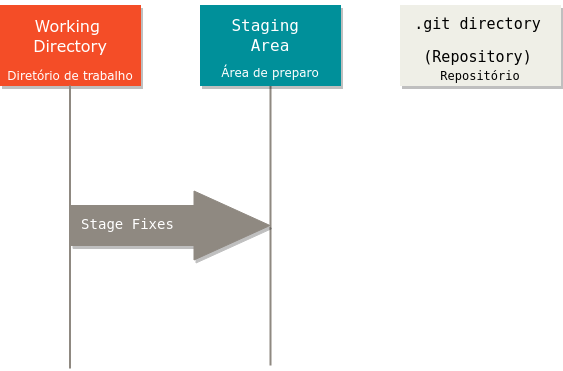
```
<font size= 3>  Você modifica arquivos no seu diretório de trabalho e 
prepara eles adicionando as imagens deles à sua área de preparo.</font>

---
class: animated, fadeIn

### Fluxo de trabalho

```{r, out.width='70%', fig.align='center', echo=FALSE}
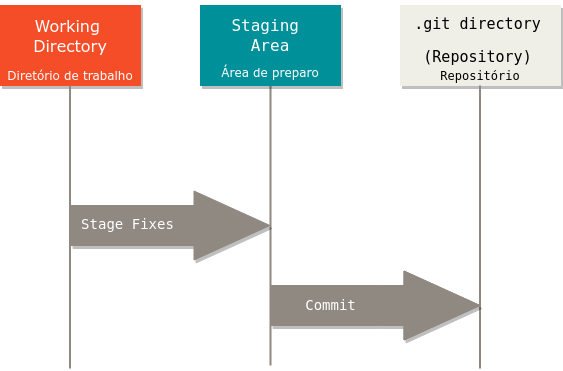
```

<font size= 3> Você leva os arquivos da área de preparo e armazena essas
imagens para o diretório do Git.</font>
---
class: animated, fadeIn

### Fluxo de trabalho

```{r, out.width='70%', fig.align='center', echo=FALSE}
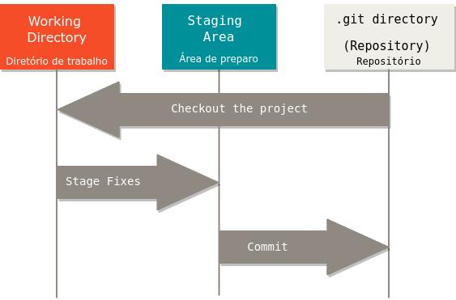
```

<font size= 3> E tudo se repete!</font>

---
class: inverse, hide-logo, middle, center

#  Repositórios

---
class: animated, bounceInDown

### Criando um Repositório `Git` - I

Existem diferentes formas de usar o `Git`, entre elas temos as 
ferramentas originais de *linha de comando*, e existem as interfaces gráficas de 
usuário (GUI - Graphical User Interface) com opções variadas. Nesta
apresentação usaremos o `Git` na <ins>linha de comando</ins>. 
A linha de comando é o único lugar onde você pode rodar **todos** os 
comandos do `Git`. 

> Se você sabe como usar o Git na linha de comando, você provavelmente 
descobrirá como rodar versões GUI.


Dessa forma, você pode obter um projeto `Git` utilizando duas formas 
principais:
- <ins>Transformando</ins> um diretório local em um *repositório*;
- Fazendo um <ins>clone</ins> de um *repositório* `Git` existente em outro lugar.


---
class: animated, fadeIn

### Criando um Repositório Git - II

#### Inicializando um repositório em um diretório existente

Para você começar o monitoramento com `Git` de um projeto existente, 
você deve ir ao diretório desse projeto e executar o seguinte comando:
`git init`.

**Por exemplo:**

```{r, out.width='70%', fig.align='center', echo=FALSE}
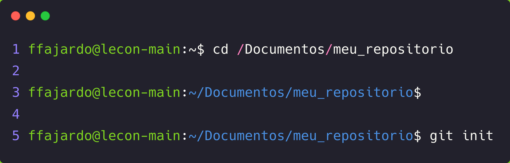
```

Isso cria um novo subdiretório chamado `.git` que contém todos os 
arquivos necessários de seu repositório. **Neste ponto, nada em seu 
projeto é monitorado ainda**.

---
class: animated, slideInRight

### Criando um Repositório Git - II

```{r, out.width='90%', fig.align='center', echo=FALSE}
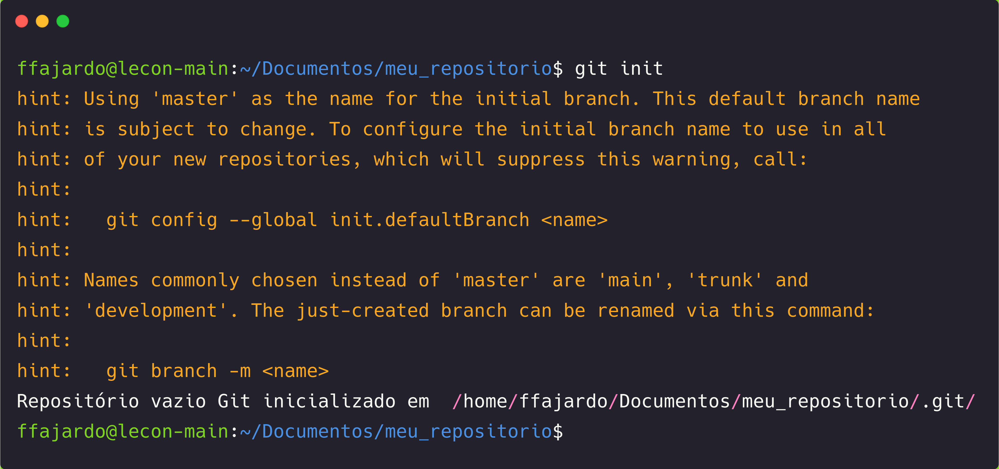
```

---
class: animated, bounceInDown

### Criando um Repositório Git - II

```{r, out.width='85%', fig.align='center', echo=FALSE}
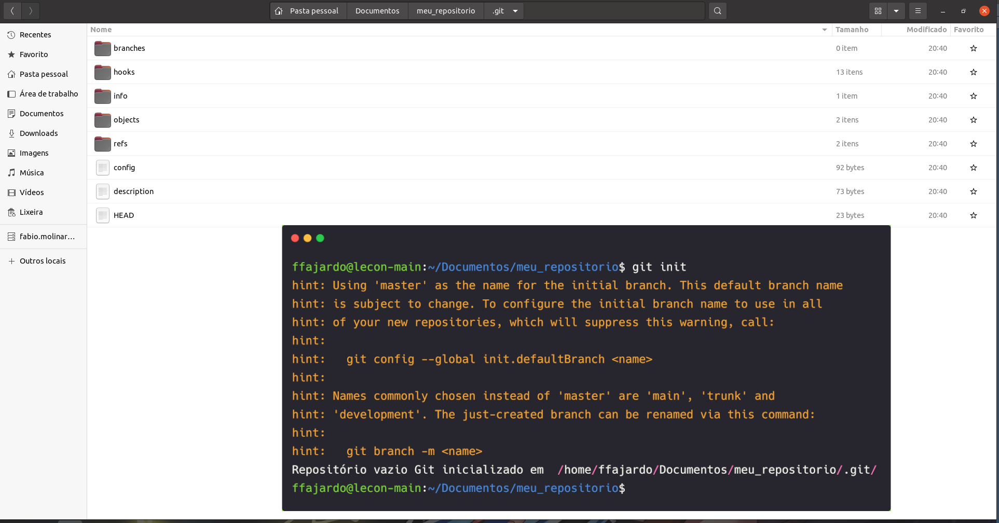
```

<font size="3"> Para mais informações sobre quais arquivos 
estão contidos no diretório `.git`, vide 
<a href="http://git-scm.com/book/en/v2/Git-Internals-Plumbing-and-Porcelain">Git Internals</a>.</font>

---
class: animated, slideInRight

### Controlando o versionamento dos arquivos - I

A principal ferramenta que você vai usar para determinar o <ins>estado</ins>
dos arquivos é o comando `git status`. Se você executar esse comando 
imediatamente após criar um repositório, você vai ver algo assim:

```{r, out.width='90%', fig.align='center', echo=FALSE}
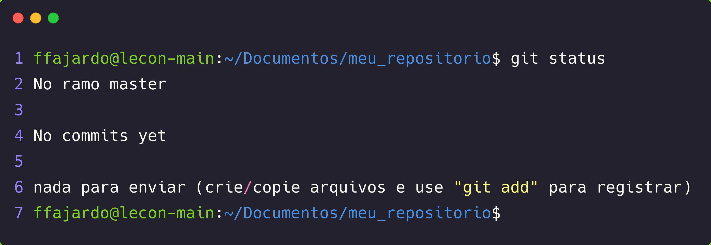
```

Isso significa que nenhum de seus arquivos rastreados foi modificado. 
O `Git` também não está vendo nenhum arquivo não rastreado, senão eles 
estariam listados aqui. 

---
class: animated, fadeIn

### Controlando o versionamento dos arquivos - II

**Exemplo**: Crie um arquivo de texto chamado `README.md` e use
o comando `git status` para verificar o novo estado do arquivo.


```{r, out.width='85%', fig.align='center', echo=FALSE}
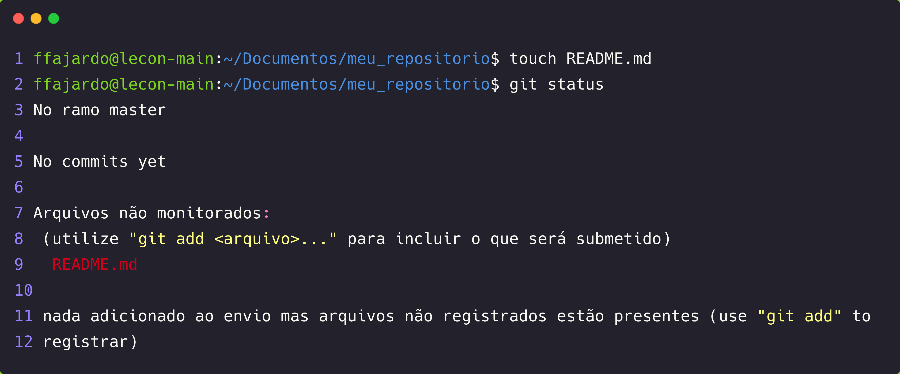
```


---
class: animated, fadeIn

### Controlando o versionamento dos arquivos - II

**Exemplo**: Use o comando `git add` para iniciar o monitoramento do 
arquivo. Em outras palavras, o comando `git add` permite enviar o
arquivo para o `stage` (área de preparo).

```{r, out.width='70%', fig.align='center', echo=FALSE}
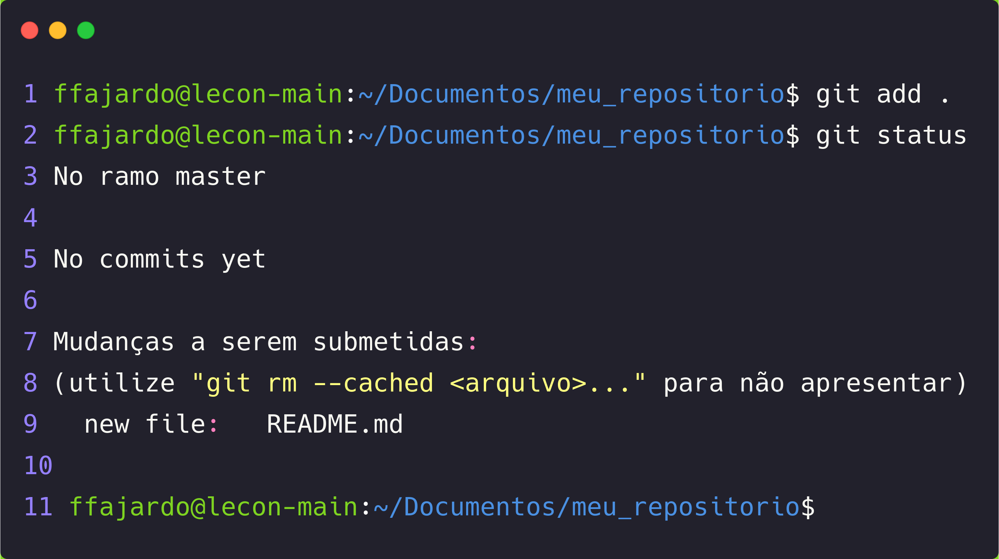
```


---
class: animated, fadeIn

### Controlando o versionamento dos arquivos - II

```{r, out.width='70%', fig.align='center', echo=FALSE}
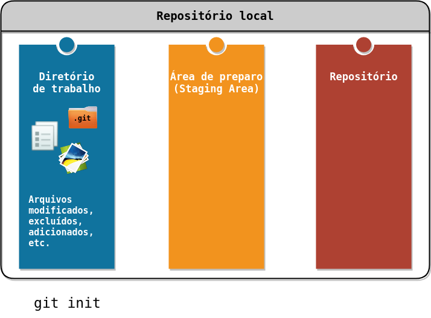
```

---
class: animated, fadeIn

### Controlando o versionamento dos arquivos - II

```{r, out.width='70%', fig.align='center', echo=FALSE}
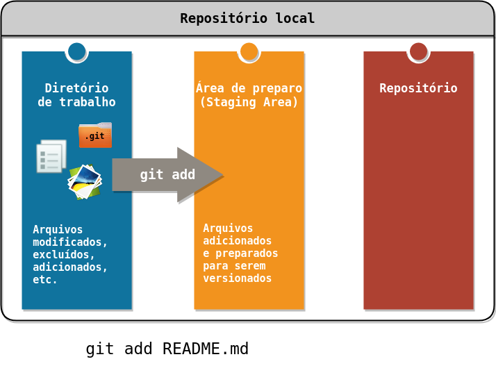
```
---
class: animated, fadeIn

### Controlando o versionamento dos arquivos - II

```{r, out.width='70%', fig.align='center', echo=FALSE}
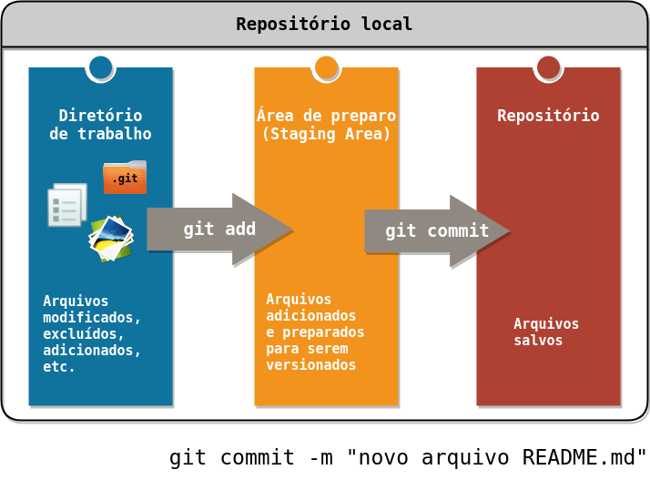
```

---
class: inverse, hide-logo, middle, center

# GitHub


---
class: inverse, hide-logo, middle, center

# Algumas ferramentas

* **.gitignore**: O arquivo `.gitignore` informa ao `Git` quais arquivos
devem ser ignorados intencionalmente.

site para criação automática dos arquivos [gitignore.io](https://www.toptal.com/developers/gitignore)


---
class: animated, lightSpeedIn
# Referências

```{r refs, echo=FALSE, results="asis"}
PrintBibliography(myBib, .opts = list(check.entries = FALSE))
```

---
class: animated, hide-logo, bounceInDown
## Política de proteção aos direitos autorais

> <span style="color:grey">O conteúdo disponível consiste em material protegido pela legislação brasileira, sendo certo que, por ser
o detentor dos direitos sobre o conteúdo disponível na plataforma, o **LECON** e o **NEAEST** detém direito
exclusivo de usar, fruir e dispor de sua obra, conforme Artigo 5<sup>o</sup>, inciso XXVII, da Constituição Federal
e os Artigos 7<sup>o</sup> e 28<sup>o</sup>, da Lei 9.610/98.
A divulgação e/ou veiculação do conteúdo em sites diferentes à plataforma e sem a devida autorização do
**LECON** e o **NEAEST**, pode configurar violação de direito autoral, nos termos da Lei 9.610/98, inclusive podendo
caracterizar conduta criminosa, conforme Artigo 184<sup>o</sup>, §1<sup>o</sup> a 3<sup>o</sup>, do Código Penal.
É considerada como contrafação a reprodução não autorizada, integral ou parcial, de todo e qualquer
conteúdo disponível na plataforma.</span>

.pull-left[
```{r, out.width='50%', fig.align='center', fig.cap='',echo=FALSE}
knitr::include_graphics("images/logo_lecon.png")
```
]
.pull-right[
```{r, out.width='50%', fig.align='center', fig.cap='',echo=FALSE}
knitr::include_graphics("images/logo_neaest.png")
```
]
<br></br>
.center[
[https://lecon.ufes.br](https://lecon.ufes.br/) &emsp; &emsp;  &emsp; &emsp; [https://analytics.ufes.br](https://analytics.ufes.br)
]

<font size="2"><span style="color:grey">Material elaborado pela equipe LECON/NEAEST: 
Alessandro J. Q. Sarnaglia, Bartolomeu Zamprogno, Fabio A. Fajardo, Luciana G. de Godoi 
e Nátaly A. Jiménez.</span></font>
